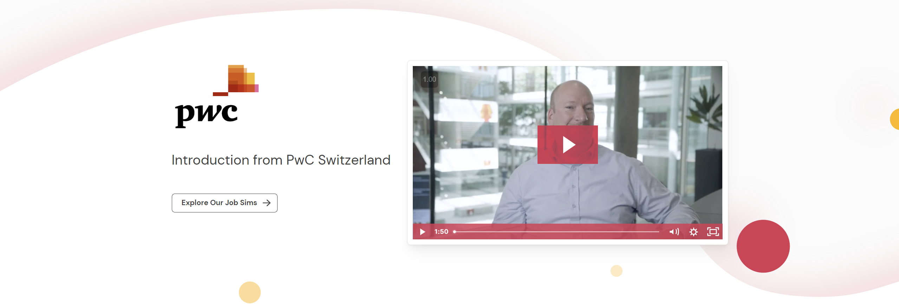

# PwC Switzerland Job Simulation (Forage)

<a href="https://www.theforage.com/simulations/pwc-ch/power-bi-cqxg" target="_blank"><a/>

This repository contains a series of Power BI projects based on a job simulation provided by [**PwC Switzerland** through **Forage**](https://www.theforage.com/simulations/pwc-ch/power-bi-cqxg). The aim is to gain hands-on experience with data analysis and visualization tools like Power BI, focusing on real-world business challenges such as customer retention, call center performance, and diversity & inclusion initiatives.

By completing these tasks, participants develop skills in:

- Data visualization
- Defining Key Performance Indicators (KPIs)
- Data-driven decision making
- Power BI dashboard creation
- Analytical thinking

The simulation is divided into three different very insightful projects:
1. **Call Center Trends Analysis**: Visualizing customer satisfaction and agent performance.
2. **Customer Retention Analysis**: Identifying key metrics to predict customer churn and improve loyalty.
3. **Diversity & Inclusion Analysis**: Tracking and improving gender balance at the executive level.


## About PwC Switzerland

**PwC Switzerland** is a leading professional services firm specializing in assurance, tax, and advisory services. With a commitment to building trust in society and solving important problems, PwC helps organizations and individuals create the value they're looking for.

## Prerequisites

- **Power BI Desktop**: Required to open and interact with `.pbix` files.
- **Microsoft Excel**: For viewing and understanding the datasets.
- Basic understanding of data analytics and visualization concepts.

## Project Structure

```plaintext
pwc-powerbi-analytics/
├───assets/
└───tasks/
    ├───1-call-center/
    │       dataset.xlsx
    │       README.md
    │       visuals.pbix
    │
    ├───2-customer-retention/
    │       dataset.xlsx
    │       README.md
    │       visuals.pbix
    │
    └───3-diversity-task/
            dataset.xlsx
            README.md
            visuals.pbix
```

- **assets/**: Contains images and media assets used in documentation.
- **tasks/**: Each task folder contains a dataset, a Power BI visualization file, and a task-specific README.

## Installation and Usage

1. **Clone the Repository**

   ```bash
   git clone https://github.com/YashitaCodes/pwc-powerbi-analytics.git
   cd pwc-powerbi-analytics/
   ```

2. **Navigate to a Task Directory**

   ```bash
   cd tasks/1-call-center
   ```

3. **Open the Power BI File**

   - Launch **Power BI Desktop**.
   - Open the `.pbix` file located in the task directory.

4. **Explore the Dashboard**

   - Interact with the visualizations.
   - Analyze the data to gain insights.

## Tasks Overview

### [1. Call Center Trends Analysis](tasks/1-call-center/README.md)

- **Objective**: Analyze call center metrics to improve customer satisfaction and operational efficiency.

### [2. Customer Retention Analysis](tasks/2-customer-retention/README.md)

- **Objective**: Identify factors affecting customer churn and develop strategies for retention.

### [3. Diversity & Inclusion Analysis](tasks/3-diversity-task/README.md)

- **Objective**: Evaluate gender balance within the organization and propose actionable insights for improvement.

## Additional Resources

- **Forage Platform**: [Forage](https://www.theforage.com/) provides virtual job simulations to help students gain practical skills.
- **PwC's Digital Upskilling**: Learn more about PwC's commitment to digital transformation and upskilling [here](https://www.pwc.ch/en.html).

## License

This project is intended for educational purposes as part of a job simulation exercise provided by PwC Switzerland through Forage.

## Conclusion

By completing this task, you gain practical experience in transforming raw data into meaningful insights that can drive business decisions. The skills developed here are directly applicable to real-world scenarios in data analytics and business intelligence.

## License

This project is part of an educational simulation provided by PwC Switzerland through Forage and is intended for learning and development purposes.

