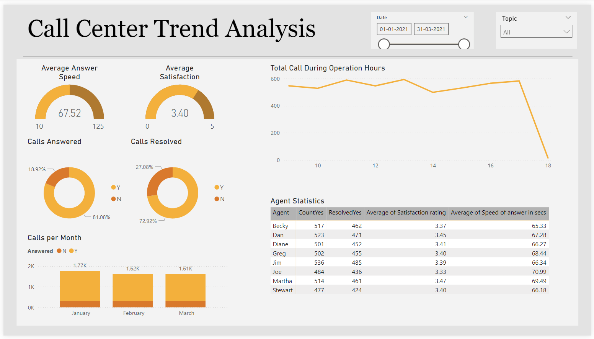

# **Call Center Trends Analysis**

This Power BI dashboard focuses on analyzing the trends and performance metrics in a call center environment. It provides insights into customer satisfaction, call volumes, and agent efficiency. By understanding these metrics, companies can identify areas for improvement and optimize call center operations for better customer experience.

#### Objectives:
- Visualize key metrics like call volume, customer satisfaction, and agent performance.
- Provide actionable insights to improve call center efficiency and customer support.

#### How to Use:
1. Download the Power BI `.pbix` file from the repository.
2. Open the file using Power BI Desktop.
3. Explore the dashboard by navigating through the different visualizations to gain insights.

#### Features:
- **Customer Satisfaction Score**: Visualizes the average satisfaction score from customer feedback.
- **Call Volume by Time**: Highlights peak hours for calls to optimize agent availability.
- **Agent Performance**: Evaluates each agent's handling time and success rates.

