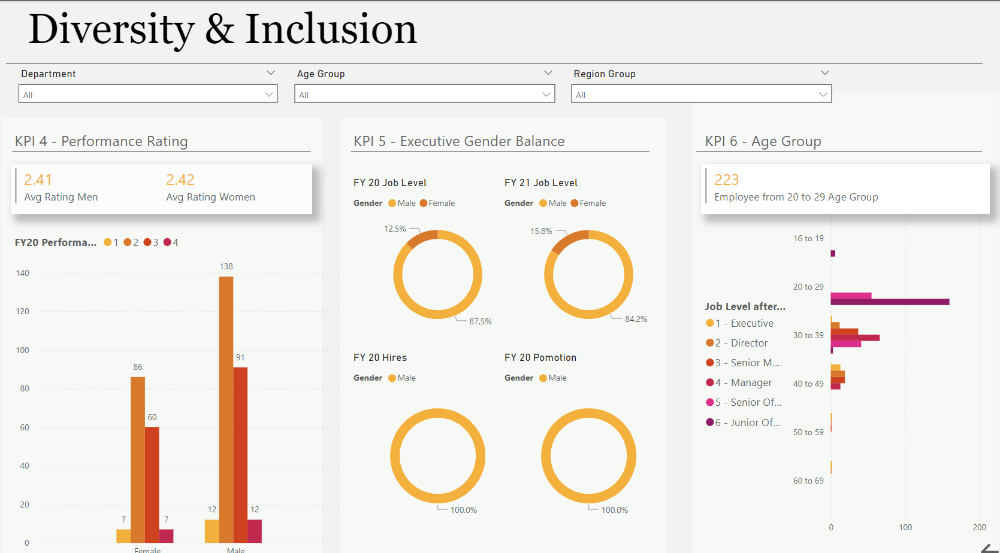

# **Diversity & Inclusion Analysis**

This dashboard focuses on tracking gender balance and diversity within a company, particularly at the executive management level. It visualizes various diversity metrics and highlights areas where progress is slow, allowing for better diversity and inclusion strategies.

#### Objectives:
- Visualize gender diversity at the executive level.
- Provide insights into areas where gender balance can be improved.

#### How to Use:
1. Download the `.pbix` file related to diversity and inclusion from the repository.
2. Open it using Power BI Desktop.
3. Navigate through the dashboard to explore diversity metrics.

#### Features:
- **Gender Diversity by Department**: Breakdown of gender representation across different departments.
- **Executive Gender Balance**: Visualizes the gender ratio at the executive level.
- **Diversity Trends**: Shows progress over time in achieving diversity goals.

